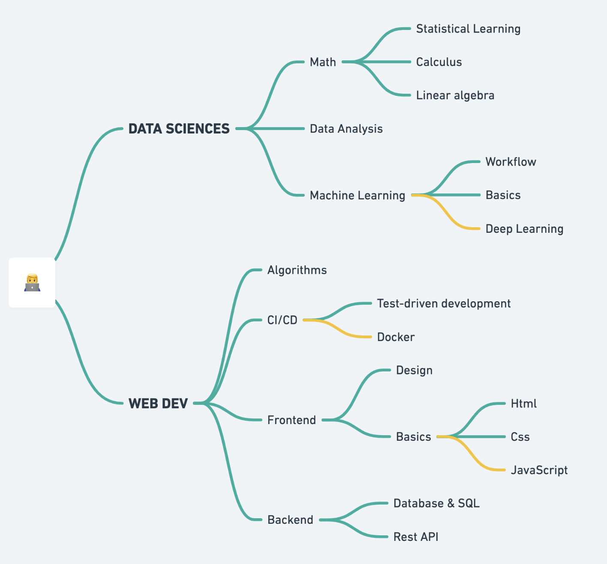

# 🧠 My learning path
Ce dossiers regroupe les principaux projets que j'ai implémenté pour me former en autonomie à la `science des données`et au `développement web`. J'ai  également ajouter la liste des cours et livres que j'ai utilisé pour m’instruire. 

 

  

 

*Si vous êtes ici pour évaluer mon niveau, j'ai placer un émoticône "⭐️"  à côté des projets qui incarne le mieux mon niveau actuel.* 
 
 

## 👨‍💻 MES PROJETS

### Data Analysis
- **[Dashboard Contaminations Covid-19]()**, un tableau de bord pour suivre et explorer la propagation du Covid-19 ⭐️ 
- **[Analyse des ventes d'une entreprise]()**, un rapport d'analyses des ventes d'une entreprise fictif d’électronique
- **[Qui est le joueur de foot le plus prolifique ?]()** Un tableau de bord qui compare les footballeurs qui ont le plus d'impactes sur les buts adverses 

    
### Machine learning
- **[Prédire le prix de ventes des maison]()**, un modèle de machine learning capable de prédire le prix de vente d'une maisons suivant une centaine de caractéristiques. Avec une précision de: ... ⭐️
- **[Diagnostiquer le diabètes chez un patient]()**, un modele de machine learning capable de prédire à partir d'un diagnostic médical si un patient est atteint du diabètes avec une précision de 73% 
- **[Algorithms from scratch]()**, 3 fonctions coûts codées "de zéro", c’est-à-dire uniquement  à partir de Numpy, la librairie Numérique de Python

    
### Web development
- **[Rest auth api]()**, un REST API qui permet de gérer l'authentification et les permissions de différents groupes d'utilisateurs ⭐️
- **[Forum de discussion]()**, un forum de discussion implémenté à partir du framework Django
- **[Frontend d'une messagerie emails]()**, le côté client d'une application web de messagerie implementer avec le framework Django (WEB50 projet 3)
- **[Écrire des requêtes SQL pour résoudre un mystère]()**, retrouver un criminel à partir d'une base de données et d'indices *- jeu de rôle mis en scène par l’université d’Harvard: CS50 projet 7*
- **[Une application web pour gérer des portefeuilles d'actions]()**, création d'un site web pour acheter et vendre des actions financières  *(CS50 projet 9)* 
 
 

## 📚 Mes livres
- [Python for Data Analysis](https://www.oreilly.com/library/view/python-for-data/9781449323592/) *by Wes McKinney*, pour résoudre efficacement un large éventail de problèmes d'analyse de données
- [Hands on machine learning with scikit learn & Tensor flow](https://www.amazon.fr/Hands-Machine-Learning-Scikit-learn-Tensorflow-dp-1492032646/dp/1492032646/ref=dp_ob_title_bk) *by Aurélien Géron*, pour comprendre la méthodologie et les concepts du machine learning
- [An Introduction to statistical learning](https://www.statlearning.com/) *by Gareth James, Daniela Witten and co*, pour comprendre le fonctionnement mathématique des différents modèles de Machine Learning 
- [Clean code](https://www.amazon.com/Clean-Code-Handbook-Software-Craftsmanship/dp/0132350882) by Robert C. Martin, pour mieux structurer son code
 
 

## 👩‍🏫 Mes cours
- **Maths**
    - Introduction to [Linear Algebra](https://www.youtube.com/playlist?list=PLZHQObOWTQDPD3MizzM2xVFitgF8hE_ab) and [Calculus](https://www.youtube.com/playlist?list=PLZHQObOWTQDMsr9K-rj53DwVRMYO3t5Yr) *by 3b1b*
    - [Multivariable calculus](https://www.khanacademy.org/math/multivariable-calculus) *by* *Khan Academy*
    - [Probability and Statistics](https://www.khanacademy.org/math/statistics-probability) *by Khan Academy*
- **[Introduction à SQL et aux bases de données](https://www.youtube.com/watch?v=3KwmNNucIjA&list=PLrSOXFDHBtfGl66sXijiN8SU9YJaM_EQg)**, une formations de 22 videos sur le fonctionnement des bases de données avec mysql. Ressource française 
- **[CS50](https://cs50.harvard.edu/x/2021/)**, le cours introductif d'Harvard concernant les sciences de l’informatique. Une vrai mine d'or !  
- **[WEB50](https://cs50.harvard.edu/web/2020/)**, cours dispensés par l’université de Harvard pour découvrir le développement web
 
 

## 🚀 Next step
- approfondir dans le deep learning
- découvrir React
- en apprendre plus sur Firebase
